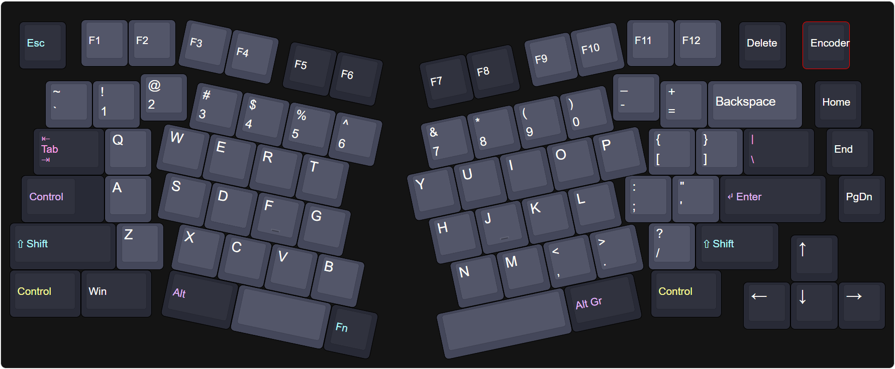

# 𝕬𝖉𝖊𝖑𝖍𝖊𝖎𝖉

The Adelheid is a 75% Alice-like keyboard.  
It's a fork of FateNozomi's Arisu files: [Arisu PCB](https://github.com/FateNozomi/arisu-pcb) &amp; [Arisu case](https://github.com/FateNozomi/arisu-case)

This repo is a hand-wired version fork from [floookay's Adelheid]: https://github.com/floookay/adelheid with some changes.

This repository includes files for:

- a layered case &rarr; [README.md](./case/README.md)

## Changes in this fork

Here is a list of things I added in this fork in comparison to the original Adelheid:

- [x] replaced page up with a rotary encoder
- [x] lowered home, end, and page up keys
- [x] added win and right control keys
- [x] used pro micro as the controller
- [x] changed thickness of some acrylics

## Layout

A spaced 75% layout on top of the Alice/Arisu-layout.

[Keyboard-Layout-Editor](http://www.keyboard-layout-editor.com/#/gists/3d5f924367b3b31ac1beb2d660264759)
 

## Firmware

See [firmware](https://github.com/millaizha/adelheid-hand-wire/tree/master/firmware)

## Images

For more images see [images.md](./IMAGES.md).

