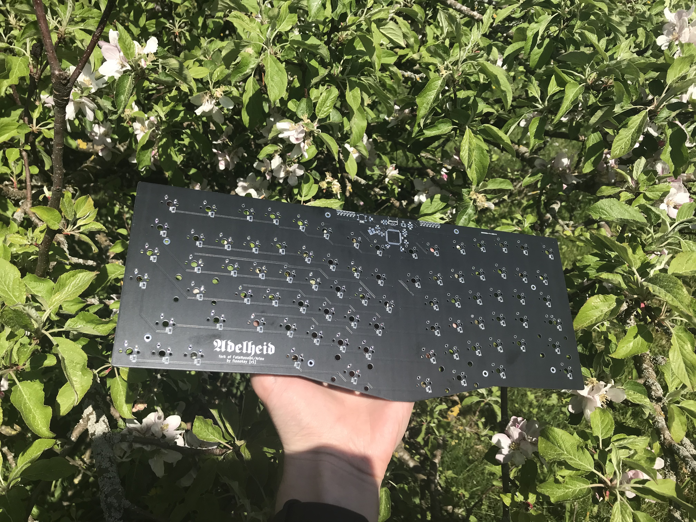

# 𝕬𝖉𝖊𝖑𝖍𝖊𝖎𝖉 - PCB

  

The PCB for the Adelheid was designed using KiCAD on top of the Arisu PCB files.

## Changes to Arisu

- [x] Added a spaced function row
- [x] Added footprint for stepped caps lock key
- [x] Changed the micro USB port to a tht mini USB port

## FateNozomi's Arisu description

>アリス PCB designed using KiCad. The layout is inspired by Lyn's EM7 and TGR Alice with some modification of my own.
>
> Key differences:
>
> - I removed the extra [B] key on the right half and shifted the [NM,.?] row > to the left by 0.25U.
> - Shifted the 3 keys to the right and added arrow keys.
> - Tweaked the bottom so that the 1.5U keys doesn't protrude out a little.
>
> Shifting the [NM,.?] row to the left by 0.25U required quite some work on the arrangement of keys for the right half.  
> As a result, this does not give the same typing experience as Lyn's EM7 and TGR Alice.
> Lyn's EM7 and TGR Alice uses the home row as the center point to vertically align both halves while I used the number row instead.  
> Due to the nature of staggered keyboards, aligning using the number row resulted in the home row not being aligned.

## Parts list

See the attached [BOM](./adelheid.csv).

**Disclaimer**: Use these files at your own risk.
